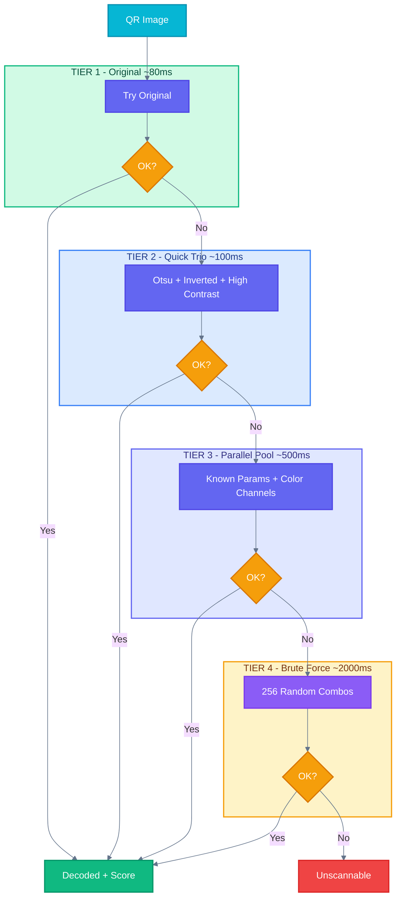

# QRAI Validator

<div align="center">


**High-performance QR code validation and scannability scoring for artistic QR codes**

[Features](#features) • [Installation](#installation) • [Usage](#usage) • [Benchmarks](#benchmarks) • [Architecture](#architecture)

</div>

---

## Features

- **Multi-Decoder Engine** — Dual decoder system (rxing + rqrr) with automatic fallback
- **Tiered Strategy** — 4-tier progressive decoding from instant to brute-force
- **Artistic QR Support** — Optimized for AI-generated and stylized QR codes
- **Scannability Score** — 0-100 score based on real-world stress tests
- **Parallel Processing** — Rayon-powered parallel preprocessing with early exit
- **Node.js Bindings** — Native napi-rs integration for JavaScript/TypeScript
- **CLI Tool** — Command-line interface with colored output

---

## Performance

### Benchmark Results (74 Artistic QR Codes)

| Metric | Value |
|--------|-------|
| **Success Rate** | 66/74 (89.2%) |
| **Average Time** | 967ms |
| **Fastest** | 77ms (clean QRs) |
| **Target** | <200ms (clean), <1000ms (artistic) |

### Speed Tiers

```
⚡ FAST    (<200ms)   │████████████████░░░░│ 15 images (20%)
🟢 GOOD   (200-500ms) │█████████░░░░░░░░░░░│  9 images (12%)
🟡 MEDIUM (500-1500ms)│████████████████████│ 33 images (45%)
🔴 SLOW   (>1500ms)   │█████████░░░░░░░░░░░│  9 images (12%)
❌ FAILED             │████████░░░░░░░░░░░░│  8 images (11%)
```

### Before/After Optimization

| Phase | Artistic QR Time | Improvement |
|-------|-----------------|-------------|
| Initial | 5-11 seconds | baseline |
| Phase 1: Remove slow strategies | ~2 seconds | 5x faster |
| Phase 2: Single luma8 conversion | ~1.5 seconds | 7x faster |
| Phase 3: Strategy reordering | ~1 second | 10x faster |
| Phase 4: Rayon parallelization | ~967ms | **11x faster** |

---

## Architecture

### Tiered Decoder Flow



### Project Structure

```
qrai-validator/
├── crates/
│   ├── qrai-core/          # Core library
│   │   ├── src/
│   │   │   ├── decoder.rs  # Multi-decoder + tiered strategies
│   │   │   ├── scorer.rs   # Stress tests + scoring
│   │   │   ├── types.rs    # ValidationResult, QrMetadata
│   │   │   └── error.rs    # Error types
│   │   └── Cargo.toml
│   ├── qraisc-cli/         # CLI binary
│   └── qrai-node/          # Node.js bindings (napi-rs)
├── test-images/            # Benchmark QR codes
├── scripts/                # Benchmark & test scripts
└── docs/                   # Design documents
```

### Preprocessing Strategies

| Tier | Strategy | Time Budget | Description |
|------|----------|-------------|-------------|
| 1 | Original | ~80ms | Direct decode, no preprocessing |
| 2 | Quick Trio | ~100ms | Otsu threshold, inverted, high contrast |
| 3 | Parallel Pool | ~500ms | Color channels (R/G/B/Sat), HSV, custom grayscale |
| 4 | Brute Force | ~2000ms | 256 random combos: size, contrast, blur, grayscale |

---

## Installation

### CLI

```bash
cargo install --path crates/qraisc-cli
```

### Node.js

```bash
cd crates/qrai-node
npm install
npm run build
```

### As Rust Library

```toml
[dependencies]
qrai-core = { git = "https://github.com/SuperNovae-studio/qrai-validator" }
```

---

## Usage

### CLI

```bash
# Full validation with JSON output
qraisc image.png

# Pretty printed JSON
qraisc -p image.png

# Score only (for scripts)
qraisc -s image.png
# Output: 85

# Decode only (fast, no stress tests)
qraisc -d image.png
```

### Rust

```rust
use qrai_core::validate;

let image_bytes = std::fs::read("qr.png")?;
let result = validate(&image_bytes)?;

println!("Score: {}", result.score);
println!("Content: {:?}", result.content);
println!("Stress tests: {:?}", result.stress_results);
```

### Node.js

```typescript
import { validate, decode, validateScoreOnly } from '@qrcodeai/qrai-validator';
import { readFileSync } from 'fs';

const imageBuffer = readFileSync('qr.png');

// Full validation
const result = validate(imageBuffer);
console.log(`Score: ${result.score}`);
console.log(`Content: ${result.content}`);

// Fast decode (no stress tests)
const decoded = decode(imageBuffer);
console.log(`Content: ${decoded.content}`);

// Score only
const score = validateScoreOnly(imageBuffer);
console.log(`Score: ${score}`);
```

---

## Scoring System

The scannability score is computed by running the QR through stress tests:


| Test | Weight | Description |
|------|--------|-------------|
| Original | 20 | Decode at original resolution |
| Downscale 50% | 15 | Decode at half size |
| Downscale 25% | 10 | Decode at quarter size |
| Blur (light) | 15 | Decode with σ=1.0 Gaussian blur |
| Blur (medium) | 10 | Decode with σ=2.0 Gaussian blur |
| Low Contrast | 15 | Decode with 50% contrast reduction |
| Multi-decoder | 15 | Bonus if both rxing and rqrr succeed |

**Score = (passed tests × weights) / total weight × 100**

---

## Development

```bash
# Run tests
cargo test --workspace

# Build release
cargo build -p qraisc-cli --release

# Run benchmarks
bash scripts/benchmark-artistic.sh

# Format code
cargo fmt --all

# Lint
cargo clippy --workspace
```

---

## Dependencies

| Crate | Purpose |
|-------|---------|
| [rxing](https://crates.io/crates/rxing) | Primary QR decoder (ZXing port) |
| [rqrr](https://crates.io/crates/rqrr) | Fallback decoder (Quirc port) |
| [image](https://crates.io/crates/image) | Image loading & transforms |
| [rayon](https://crates.io/crates/rayon) | Parallel processing |
| [napi](https://crates.io/crates/napi) | Node.js bindings |
| [clap](https://crates.io/crates/clap) | CLI argument parsing |

---

## Why Artistic QRs Are Hard

Artistic/AI-generated QR codes present unique challenges:

1. **Low Contrast** — Artistic elements blend with QR modules
2. **Color Interference** — Non-standard colors confuse decoders
3. **Central Obstructions** — Large images covering data area
4. **Texture Noise** — Gradients and patterns create false edges

Our tiered approach handles 89% of artistic QRs by progressively applying more aggressive preprocessing until successful decode.

---

## License

MIT License - see [LICENSE](LICENSE) for details.

---

## Author

**Thibaut** @ [SuperNovae Studio](https://supernovae.studio)

Built with Rust for [QR Code AI](https://qrcodeai.app)
