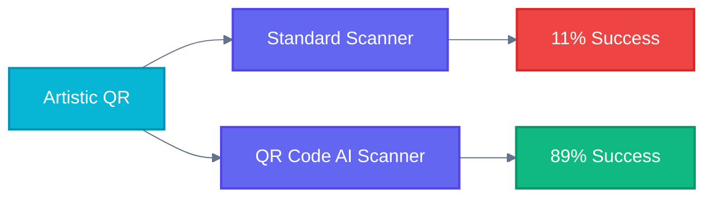

# QR Code AI Scanner

<div align="center">

<h3>High-Performance QR Code Validation & Scannability Scoring</h3>

<p>
<strong>Decode the undecodable.</strong> Built for QR codes that break standard scanners:<br/>
🎨 <strong>Artistic</strong> · 🖼️ <strong>Image-embedded</strong> · 🎯 <strong>Custom styled</strong> · 📸 <strong>Photo-captured</strong>
</p>

<p><em>Part of the <a href="https://qrcode-ai.com">QR Code AI</a> ecosystem · <a href="https://github.com/supernovae-st/qrcode-ai">GitHub</a></em></p>

[](https://www.rust-lang.org/)
[](LICENSE)
[](README.md#benchmarks)
[](README.md#benchmarks)
[](README.md#nodejs)
[](https://crates.io/crates/qrcode-ai-scanner-core)
[](https://www.npmjs.com/package/@supernovae-st/qrcode-ai-scanner)

<br>

[Installation](#installation) · [Quick Start](#quick-start) · [Why This Scanner?](#why-this-scanner) · [Benchmarks](#benchmarks) · [API Reference](#api-reference)

</div>

> **License:** This software is [AGPL-3.0](LICENSE) licensed. If you modify it and provide it as a network service, you must make your source code available. [Learn more](https://www.gnu.org/licenses/agpl-3.0.en.html).

---

## At a Glance

```mermaid
%%{init: {'theme': 'base', 'themeVariables': {'lineColor': '#64748b'}}}%%
flowchart LR
    classDef input fill:#06b6d4,stroke:#0891b2,stroke-width:2px,color:#ffffff
    classDef process fill:#6366f1,stroke:#4f46e5,stroke-width:2px,color:#ffffff
    classDef output fill:#10b981,stroke:#059669,stroke-width:2px,color:#ffffff

    A[📷 Image]:::input --> B[Scanner<br>4-Tier Decode]:::process
    B --> C[✅ Content]:::output
    B --> D[📊 Score]:::output
    B --> E[📋 Metadata]:::output
```



---

## Installation

### Node.js

Requires [Node.js](https://nodejs.org/) 18+ (includes npm).

```bash
npm install @supernovae-st/qrcode-ai-scanner
```

```typescript
import { validate, score } from '@supernovae-st/qrcode-ai-scanner';
```

### Rust CLI

Requires [Rust](https://rustup.rs/) toolchain.

```bash
cargo install qrcode-ai-scanner-cli
```

```bash
qrcode-ai image.png        # Full validation
qrcode-ai -s image.png     # Score only
```

### Rust Library

```bash
cargo add qrcode-ai-scanner-core
```

```rust
use qrcode_ai_scanner_core::{validate, score};
```

---

## Quick Start

### One-liner Rust

```rust
use qrcode_ai_scanner_core::is_valid;

// Check if QR is valid and get content
if let Some(content) = is_valid("qr.png") {
    println!("QR contains: {}", content);
}
```

### Score Check

```rust
use qrcode_ai_scanner_core::{score, passes_threshold};

// Get scannability score (0-100)
let s = score("qr.png");
println!("Score: {}/100", s);

// Check if production-ready (score >= 70)
if passes_threshold("qr.png", 70) {
    println!("Ready for production!");
}
```

### Full Validation

```rust
use qrcode_ai_scanner_core::validate;

let bytes = std::fs::read("qr.png")?;
let result = validate(&bytes)?;

println!("Score: {}", result.score);           // 0-100
println!("Content: {:?}", result.content);      // Decoded text
println!("Version: {:?}", result.metadata);     // QR metadata
```

### Node.js

```typescript
import { validate, decode } from '@supernovae-st/qrcode-ai-scanner';
import { readFileSync } from 'fs';

const result = validate(readFileSync('qr.png'));
console.log(`Score: ${result.score}/100`);
console.log(`Content: ${result.content}`);
```

### CLI

```bash
# Full validation (JSON)
qrcode-ai image.png

# Score only (for scripts)
qrcode-ai -s image.png    # Output: 85

# Decode only (fast)
qrcode-ai -d image.png
```

---

## Why This Scanner?



### The Problem

Standard QR scanners fail on non-standard QR codes:

| QR Type | Challenge | Why Scanners Fail |
|---------|-----------|-------------------|
| 🎨 **Artistic** | AI-generated art styles | Extreme visual noise, pattern interference |
| 🖼️ **Image-embedded** | QR inside photos | Background confusion, perspective distortion |
| 🎯 **Custom styled** | Colors, logos, blur effects | Non-black/white colors, central obstructions |
| 📸 **Photo-captured** | Camera photos of QR codes | Lighting, blur, angle, compression artifacts |
| 🔀 **Multi-pattern** | Gradients, textures, rounded corners | False edges, module boundary confusion |

### The Solution

QR Code AI Scanner uses a **4-tier progressive decoding strategy** that applies increasingly aggressive preprocessing until successful decode:


---

## Benchmarks

### Test Results: 74 Artistic QR Codes


| Metric | Value | Notes |
|--------|-------|-------|
| **Success Rate** | 66/74 (89.2%) | vs ~10% for standard scanners |
| **Average Time** | 967ms | Includes all tiers |
| **Fastest** | 77ms | Clean QRs (Tier 1) |
| **P95** | ~2000ms | Artistic QRs (Tier 3-4) |

### Speed Distribution by Tier


### Optimization Journey


| Phase | Strategy | Time | Speedup |
|-------|----------|------|---------|
| Initial | Baseline | 5-11s | — |
| Phase 1 | Remove slow strategies | ~2s | 5x |
| Phase 2 | Single luma8 conversion | ~1.5s | 7x |
| Phase 3 | Strategy reordering | ~1s | 10x |
| Phase 4 | Rayon parallelization | ~967ms | **11x** |

### Score vs Speed Analysis

| Category | Score | Speed | Description |
|----------|-------|-------|-------------|
| **Clean QRs** | High (80+) | Fast (<200ms) | Standard QRs, Tier 1 decode |
| **Light Artistic** | Good (60-80) | Medium (200-500ms) | Subtle effects, Tier 2 |
| **Heavy Artistic** | Fair (40-60) | Slow (500-1500ms) | Strong effects, Tier 3 |
| **Failed** | Poor (<40) | Variable | Undecodable or unreliable |

---

## API Reference

### Core Functions

| Function | Description | Performance |
|----------|-------------|-------------|
| `validate()` | Full validation with score | ~1s |
| `validate_fast()` | Reduced stress tests | ~500ms |
| `decode_only()` | Just decode, no score | ~100ms |

### Convenience Helpers

| Function | Description | Returns |
|----------|-------------|---------|
| `is_valid(path)` | Check if QR is valid | `Option<String>` |
| `score(path)` | Get scannability score | `u8 (0-100)` |
| `score_bytes(bytes)` | Score from bytes | `u8 (0-100)` |
| `passes_threshold(path, min)` | Check minimum score | `bool` |
| `summarize(path)` | Get simple summary | `QrSummary` |

### Scannability Score

The score (0-100) indicates how reliably the QR will scan across devices:


| Score | Rating | Production Use |
|-------|--------|----------------|
| 80-100 | Excellent | Safe for all devices |
| 60-79 | Good | Works on most devices |
| 40-59 | Fair | May fail on older phones |
| 0-39 | Poor | Consider regenerating |

---

## Node.js Integration

### Installation

```bash
cd crates/qrcode-ai-scanner-node
npm install && npm run build
```

### One-liner Examples

```typescript
import { isValid, score, isProductionReady, summarize } from '@supernovae-st/qrcode-ai-scanner';
import { readFileSync } from 'fs';

const buffer = readFileSync('qr.png');

// Check if QR is valid
const content = isValid(buffer);
if (content) {
  console.log(`QR contains: ${content}`);
}

// Get scannability score
console.log(`Score: ${score(buffer)}/100`);

// Check production readiness
if (isProductionReady(buffer)) {
  console.log('Ready for production!');
}
```

### Full Validation

```typescript
import { validate, validateFast, decode } from '@supernovae-st/qrcode-ai-scanner';
import { readFileSync } from 'fs';

const buffer = readFileSync('qr.png');

// Full validation with stress tests (~1s)
const result = validate(buffer);
console.log(`Score: ${result.score}/100`);
console.log(`Content: ${result.content}`);
console.log(`EC Level: ${result.errorCorrection}`);

// Fast validation (~500ms)
const fast = validateFast(buffer);

// Decode only, no score (~100ms)
const decoded = decode(buffer);
```

### Summary Helper

```typescript
import { summarize } from '@supernovae-st/qrcode-ai-scanner';

const summary = summarize(readFileSync('qr.png'));

console.log(summary);
// {
//   valid: true,
//   score: 85,
//   content: 'https://example.com',
//   errorCorrection: 'H',
//   rating: 'Excellent',
//   productionReady: true
// }

if (summary.productionReady) {
  await uploadToProduction(summary.content);
}
```

### API Reference (Node.js)

#### Core Functions

| Function | Description | Performance |
|----------|-------------|-------------|
| `validate(buffer)` | Full validation with score | ~1s |
| `validateFast(buffer)` | Reduced stress tests | ~500ms |
| `decode(buffer)` | Just decode, no score | ~100ms |

#### Convenience Helpers

| Function | Description | Returns |
|----------|-------------|---------|
| `isValid(buffer)` | Check if valid | `string \| null` |
| `score(buffer)` | Get score | `number (0-100)` |
| `passesThreshold(buffer, min)` | Check threshold | `boolean` |
| `isProductionReady(buffer)` | Score >= 70? | `boolean` |
| `summarize(buffer)` | Get summary | `QrSummary` |
| `getRating(score)` | Score to rating | `string` |

#### Types

```typescript
interface ValidationResult {
  score: number;              // 0-100
  decodable: boolean;
  content: string | null;
  version: number | null;     // QR version 1-40
  errorCorrection: string | null; // L/M/Q/H
  modules: number | null;
  decodersSuccess: string[];
  stressOriginal: boolean;
  stressDownscale50: boolean;
  stressDownscale25: boolean;
  stressBlurLight: boolean;
  stressBlurMedium: boolean;
  stressLowContrast: boolean;
}

interface QrSummary {
  valid: boolean;
  score: number;
  content: string;
  errorCorrection: string;
  rating: string;           // Excellent/Good/Fair/Poor
  productionReady: boolean; // score >= 70
}
```

---

## Installation

### Node.js (npm)

```bash
# From npm (recommended)
npm install @supernovae-st/qrcode-ai-scanner

# From GitHub
npm install github:supernovae-st/qrcode-ai-scanner

# Build from source
git clone https://github.com/supernovae-st/qrcode-ai-scanner.git
cd qrcode-ai-scanner/crates/qrcode-ai-scanner-node
npm install && npm run build
```

Then use it:

```typescript
import { validate, isValid, score } from '@supernovae-st/qrcode-ai-scanner';
import { readFileSync } from 'fs';

const buffer = readFileSync('qr.png');
console.log(`Score: ${score(buffer)}/100`);
```

### CLI Tool

```bash
# From crates.io
cargo install qrcode-ai-scanner-cli

# From GitHub
cargo install --git https://github.com/supernovae-st/qrcode-ai-scanner qrcode-ai-scanner-cli

# Build from source
git clone https://github.com/supernovae-st/qrcode-ai-scanner.git
cd qrcode-ai-scanner
cargo build --release -p qrcode-ai-scanner-cli

# Add to PATH (macOS/Linux)
sudo cp target/release/qrcode-ai /usr/local/bin/
```

Then use it:

```bash
qrcode-ai image.png           # Full validation
qrcode-ai -s image.png        # Score only (for scripts)
qrcode-ai -j image.png        # JSON output
```

### Rust Library

```toml
# From crates.io
[dependencies]
qrcode-ai-scanner-core = "0.2"

# From GitHub
[dependencies]
qrcode-ai-scanner-core = { git = "https://github.com/supernovae-st/qrcode-ai-scanner" }

# From local path
[dependencies]
qrcode-ai-scanner-core = { path = "../qrcode-ai-scanner/crates/qrcode-ai-scanner-core" }
```

Then use it:

```rust
use qrcode_ai_scanner_core::{validate, is_valid, score};

fn main() {
    // Simple check
    if let Some(content) = is_valid("qr.png") {
        println!("QR contains: {}", content);
    }

    // Get score
    let s = score("qr.png");
    println!("Score: {}/100", s);
}
```

### Platform Support

| Platform | Node.js | CLI | Rust |
|----------|---------|-----|------|
| macOS x64 | ✅ | ✅ | ✅ |
| macOS arm64 (M1/M2) | ✅ | ✅ | ✅ |
| Linux x64 | ✅ | ✅ | ✅ |
| Linux arm64 | ✅ | ✅ | ✅ |
| Windows x64 | ✅ | ✅ | ✅ |

---

## Architecture

### Project Structure

```
qrcode-ai-scanner/
├── crates/
│   ├── qrcode-ai-scanner-core/        # Core library (decoder, scorer, types)
│   │   ├── src/
│   │   │   ├── decoder.rs  # Multi-decoder + 4-tier strategy
│   │   │   ├── scorer.rs   # Stress tests + scoring
│   │   │   ├── types.rs    # ValidationResult, QrMetadata
│   │   │   └── error.rs    # Error types
│   │   └── Cargo.toml
│   ├── qrcode-ai-scanner-cli/         # CLI binary
│   └── qrcode-ai-scanner-node/        # Node.js napi-rs bindings
├── test-qr-speed/          # Benchmark images (74 artistic QRs)
├── scripts/                # Benchmark & test scripts
└── docs/                   # Design documents
```

### Dual Decoder System


| Decoder | Origin | Strength |
|---------|--------|----------|
| [rxing](https://crates.io/crates/rxing) | ZXing (Java) | Better on noisy images |
| [rqrr](https://crates.io/crates/rqrr) | Quirc (C) | Faster on clean images |

### Dependencies

| Crate | Purpose |
|-------|---------|
| [rxing](https://crates.io/crates/rxing) | Primary QR decoder |
| [rqrr](https://crates.io/crates/rqrr) | Fallback decoder |
| [image](https://crates.io/crates/image) | Image loading & transforms |
| [rayon](https://crates.io/crates/rayon) | Parallel processing |
| [napi](https://crates.io/crates/napi) | Node.js bindings |
| [clap](https://crates.io/crates/clap) | CLI argument parsing |

### Developer Journey


### Score Decision Flow


---

## Development

```bash
# Run tests
cargo test --workspace

# Build release
cargo build -p qrcode-ai-scanner-cli --release

# Run benchmarks
cargo bench -p qrcode-ai-scanner-core

# Format & lint
cargo fmt --all && cargo clippy --workspace
```

---

## License

AGPL-3.0

---

<div align="center">

Part of [**QR Code AI**](https://qrcode-ai.com) by **Thibaut MÉLEN** & [**SuperNovae Studio**](https://supernovae.studio)

<br/>

<a href="https://github.com/ThibautMelen">
  
</a>
&nbsp;&nbsp;
<a href="https://github.com/supernovae-st">
  
</a>

</div>
