<div align="center">

# QR Code AI Scanner

### Decode the undecodable.

**High-performance QR code validation & scannability scoring for artistic, styled, and damaged QR codes.**

[](https://crates.io/crates/qrcode-ai-scanner-core)
[](https://www.npmjs.com/package/@supernovae-st/qrcode-ai-scanner)
[](LICENSE)
[](https://github.com/supernovae-st/qrcode-ai-scanner/stargazers)
[](https://github.com/supernovae-st/qrcode-ai-scanner/actions)

<br>

**Part of the [QR Code AI](https://qrcode-ai.com) ecosystem**

[`qrcode-ai`](https://github.com/supernovae-st/qrcode-ai) · [`qrcode-ai-scanner`](https://github.com/supernovae-st/qrcode-ai-scanner) · [`qrcode-ai.com`](https://qrcode-ai.com)

<br>

[Installation](#installation) · [Quick Start](#quick-start) · [Why This Scanner?](#why-this-scanner) · [Benchmarks](#benchmarks) · [API](#api-reference)

</div>

---

## Why This Scanner?

Standard QR scanners fail on **89% of artistic QR codes**. AI-generated styles, embedded images, custom colors, and real-world camera captures break conventional decoders.

```mermaid
%%{init: {'theme': 'base', 'themeVariables': {'lineColor': '#64748b'}}}%%
flowchart LR
    accTitle: Standard vs QR Code AI Scanner
    accDescr: Comparison showing 89% success rate vs 11% for standard scanners

    classDef success fill:#10b981,stroke:#059669,stroke-width:2px,color:#ffffff
    classDef error fill:#ef4444,stroke:#dc2626,stroke-width:2px,color:#ffffff
    classDef process fill:#6366f1,stroke:#4f46e5,stroke-width:2px,color:#ffffff
    classDef data fill:#06b6d4,stroke:#0891b2,stroke-width:2px,color:#ffffff

    ART[🎨 Artistic QR]:::data --> STD[Standard Scanner]:::process
    ART --> SCANNER[QR Code AI Scanner]:::process

    STD --> FAIL[❌ 11% Success]:::error
    SCANNER --> WIN[✅ 89% Success]:::success
```



| QR Type | Challenge | Why Scanners Fail |
|---------|-----------|-------------------|
| 🎨 **Artistic** | AI-generated art styles | Extreme visual noise, pattern interference |
| 🖼️ **Image-embedded** | QR inside photos | Background confusion, perspective distortion |
| 🎯 **Custom styled** | Colors, logos, blur | Non-black/white, central obstructions |
| 📸 **Photo-captured** | Camera photos | Lighting, blur, angle, compression |

### The Solution: 4-Tier Progressive Decoding

```mermaid
%%{init: {'theme': 'base', 'themeVariables': {'lineColor': '#64748b'}}}%%
flowchart TD
    accTitle: 4-Tier Decoding Strategy
    accDescr: Progressive decoding from fast to thorough

    classDef success fill:#10b981,stroke:#059669,stroke-width:2px,color:#ffffff
    classDef process fill:#6366f1,stroke:#4f46e5,stroke-width:2px,color:#ffffff
    classDef decision fill:#f59e0b,stroke:#d97706,stroke-width:2px,color:#ffffff
    classDef error fill:#ef4444,stroke:#dc2626,stroke-width:2px,color:#ffffff
    classDef data fill:#06b6d4,stroke:#0891b2,stroke-width:2px,color:#ffffff

    INPUT[📷 QR Image]:::data --> T1

    subgraph TIER1[" Tier 1: Original ~80ms "]
        T1[Direct Decode]:::process --> D1{OK?}:::decision
    end

    D1 -->|Yes| SUCCESS
    D1 -->|No| T2

    subgraph TIER2[" Tier 2: Quick Trio ~100ms "]
        T2[Otsu + Invert + Contrast]:::process --> D2{OK?}:::decision
    end

    D2 -->|Yes| SUCCESS
    D2 -->|No| T3

    subgraph TIER3[" Tier 3: Parallel Pool ~500ms "]
        T3[R/G/B + HSV + Grayscale]:::process --> D3{OK?}:::decision
    end

    D3 -->|Yes| SUCCESS
    D3 -->|No| T4

    subgraph TIER4[" Tier 4: Brute Force ~2s "]
        T4[256 Random Combinations]:::process --> D4{OK?}:::decision
    end

    D4 -->|Yes| SUCCESS
    D4 -->|No| FAIL

    SUCCESS[✅ Decoded!]:::success
    FAIL[❌ Unscannable]:::error

    style TIER1 fill:#d1fae5,stroke:#10b981,stroke-width:2px,color:#064e3b
    style TIER2 fill:#dbeafe,stroke:#3b82f6,stroke-width:2px,color:#1e3a8a
    style TIER3 fill:#e0e7ff,stroke:#6366f1,stroke-width:2px,color:#312e81
    style TIER4 fill:#fef3c7,stroke:#f59e0b,stroke-width:2px,color:#78350f
```



---

## Installation

<table>
<tr>
<td width="33%">

### Node.js

```bash
npm install @supernovae-st/qrcode-ai-scanner
```

</td>
<td width="33%">

### Rust CLI

```bash
cargo install qrcode-ai-scanner-cli
```

</td>
<td width="33%">

### Rust Library

```bash
cargo add qrcode-ai-scanner-core
```

</td>
</tr>
</table>

**Requirements:** Node.js 18+ | Rust 1.75+

---

## Quick Start

### Node.js

```typescript
import { isValid, score, validate } from '@supernovae-st/qrcode-ai-scanner';
import { readFileSync } from 'fs';

const qr = readFileSync('artistic-qr.png');

// One-liners
const content = isValid(qr);           // "https://example.com" or null
const scannability = score(qr);        // 0-100

// Production check
if (scannability >= 70) {
  console.log('Ready for production!');
}

// Full validation
const result = validate(qr);
console.log(result.score, result.content, result.errorCorrection);
```

### Rust

```rust
use qrcode_ai_scanner_core::{is_valid, score, validate};

// One-liners
if let Some(content) = is_valid("qr.png") {
    println!("QR contains: {}", content);
}

let scannability = score("qr.png");  // 0-100

// Full validation
let bytes = std::fs::read("qr.png")?;
let result = validate(&bytes)?;
println!("Score: {}, Content: {:?}", result.score, result.content);
```

### CLI

```bash
qrcode-ai image.png         # Full validation (JSON)
qrcode-ai -s image.png      # Score only: 85
qrcode-ai -d image.png      # Decode only (fast)
```

---

## Benchmarks

### 74 Artistic QR Codes


| Metric | Value | Notes |
|--------|-------|-------|
| **Success Rate** | 89.2% | vs ~10% for standard scanners |
| **Average Time** | 967ms | Includes all tiers |
| **Fastest** | 77ms | Clean QRs (Tier 1) |
| **P95** | ~2s | Artistic QRs (Tier 3-4) |

### 11x Performance Optimization


---

## API Reference

### Core Functions

| Function | Description | Speed |
|----------|-------------|-------|
| `validate(bytes)` | Full validation + stress tests | ~1s |
| `validate_fast(bytes)` | Reduced stress tests | ~500ms |
| `decode_only(bytes)` | Just decode, no score | ~100ms |

### Convenience Helpers

| Function | Returns | Description |
|----------|---------|-------------|
| `is_valid(path)` | `string \| null` | Content if valid |
| `score(path)` | `0-100` | Scannability score |
| `passes_threshold(path, min)` | `boolean` | Score >= min? |
| `summarize(path)` | `QrSummary` | Full summary |

### Scannability Score

```mermaid
%%{init: {'theme': 'base', 'themeVariables': {'lineColor': '#64748b'}}}%%
flowchart LR
    accTitle: Scannability Score Components
    accDescr: How the score is calculated from stress tests

    classDef test fill:#6366f1,stroke:#4f46e5,stroke-width:2px,color:#ffffff
    classDef weight fill:#f59e0b,stroke:#d97706,stroke-width:2px,color:#ffffff
    classDef result fill:#10b981,stroke:#059669,stroke-width:2px,color:#ffffff

    QR[QR Image] --> T1[Original<br>20pts]:::test
    QR --> T2[50% Scale<br>15pts]:::test
    QR --> T3[25% Scale<br>10pts]:::test
    QR --> T4[Blur σ=1<br>15pts]:::test
    QR --> T5[Blur σ=2<br>10pts]:::test
    QR --> T6[Low Contrast<br>15pts]:::test
    QR --> T7[Multi-decoder<br>15pts]:::test

    T1 & T2 & T3 & T4 & T5 & T6 & T7 --> SUM[Sum]:::weight --> SCORE[0-100]:::result
```



| Score | Rating | Recommendation |
|-------|--------|----------------|
| 80-100 | Excellent | Safe for all devices |
| 60-79 | Good | Works on most devices |
| 40-59 | Fair | May fail on older phones |
| 0-39 | Poor | Consider regenerating |

---

## Architecture

```
qrcode-ai-scanner/
├── crates/
│   ├── qrcode-ai-scanner-core/     # Core library
│   │   ├── decoder.rs              # 4-tier decode strategy
│   │   ├── scorer.rs               # Stress tests & scoring
│   │   └── error.rs                # Error types
│   ├── qrcode-ai-scanner-cli/      # CLI binary
│   └── qrcode-ai-scanner-node/     # Node.js napi-rs bindings
```

### Dual Decoder System

```mermaid
%%{init: {'theme': 'base', 'themeVariables': {'lineColor': '#64748b'}}}%%
flowchart LR
    accTitle: Dual Decoder System
    accDescr: rxing as primary, rqrr as fallback

    classDef primary fill:#6366f1,stroke:#4f46e5,stroke-width:2px,color:#ffffff
    classDef fallback fill:#8b5cf6,stroke:#7c3aed,stroke-width:2px,color:#ffffff
    classDef success fill:#10b981,stroke:#059669,stroke-width:2px,color:#ffffff
    classDef data fill:#06b6d4,stroke:#0891b2,stroke-width:2px,color:#ffffff

    IMG[Image]:::data --> RXING[rxing<br>ZXing]:::primary
    RXING -->|Success| DONE[✅ Decoded]:::success
    RXING -->|Fail| RQRR[rqrr<br>Quirc]:::fallback
    RQRR --> DONE
```



| Decoder | Origin | Best For |
|---------|--------|----------|
| [rxing](https://crates.io/crates/rxing) | ZXing (Java) | Noisy images |
| [rqrr](https://crates.io/crates/rqrr) | Quirc (C) | Clean images |

### Platform Support

| Platform | Node.js | CLI | Rust |
|----------|:-------:|:---:|:----:|
| macOS (x64, arm64) | ✅ | ✅ | ✅ |
| Linux (x64, arm64) | ✅ | ✅ | ✅ |
| Windows (x64) | ✅ | ✅ | ✅ |

---

## Development

```bash
cargo test --workspace          # Run tests
cargo build --release           # Build release
cargo bench                     # Run benchmarks
cargo fmt && cargo clippy       # Format & lint
```

---

## Comparison

| Feature | QR Code AI Scanner | Standard Scanners |
|---------|:------------------:|:-----------------:|
| Artistic QR support | ✅ 89% | ❌ ~10% |
| Multi-decoder fallback | ✅ | ❌ |
| Scannability scoring | ✅ 0-100 | ❌ Binary |
| Stress test validation | ✅ 7 tests | ❌ None |
| Production readiness check | ✅ | ❌ |

---

## License

**AGPL-3.0** — Network service modifications require source disclosure. [Details](https://www.gnu.org/licenses/agpl-3.0.en.html)

---

<div align="center">

**Built by [Thibaut MÉLEN](https://github.com/ThibautMelen) & [SuperNovae Studio](https://supernovae.studio)**

<a href="https://github.com/ThibautMelen"></a>
&nbsp;
<a href="https://github.com/supernovae-st"></a>

</div>
