# QRAISC - QR AI Scanner

<div align="center">

<h3>High-Performance QR Code Validation for Artistic QR Codes</h3>

<p>
<strong>Decode the undecodable.</strong> Built for AI-generated and stylized QR codes that break standard scanners.
</p>

<p><em>Part of the <a href="https://qrcodeai.app">QR Code AI</a> ecosystem</em></p>

[](https://www.rust-lang.org/)
[](LICENSE)
[](README.md#benchmarks)
[](README.md#benchmarks)
[](README.md#nodejs)
[](https://crates.io/crates/qraisc-core)

<br>

[Quick Start](#quick-start) · [Why QRAI?](#why-qrai) · [API Reference](#api-reference) · [Benchmarks](#benchmarks) · [Architecture](#architecture)

</div>

---

## Quick Start

### One-liner Rust

```rust
use qraisc_core::is_valid;

// Check if QR is valid and get content
if let Some(content) = is_valid("qr.png") {
    println!("QR contains: {}", content);
}
```

### Score Check

```rust
use qraisc_core::{score, passes_threshold};

// Get scannability score (0-100)
let s = score("qr.png");
println!("Score: {}/100", s);

// Check if production-ready (score >= 70)
if passes_threshold("qr.png", 70) {
    println!("Ready for production!");
}
```

### Full Validation

```rust
use qraisc_core::validate;

let bytes = std::fs::read("qr.png")?;
let result = validate(&bytes)?;

println!("Score: {}", result.score);           // 0-100
println!("Content: {:?}", result.content);      // Decoded text
println!("Version: {:?}", result.metadata);     // QR metadata
```

### Node.js

```typescript
import { validate, decode } from '@qrcodeai/qrai-scanner';
import { readFileSync } from 'fs';

const result = validate(readFileSync('qr.png'));
console.log(`Score: ${result.score}/100`);
console.log(`Content: ${result.content}`);
```

### CLI

```bash
# Full validation (JSON)
qraisc image.png

# Score only (for scripts)
qraisc -s image.png    # Output: 85

# Decode only (fast)
qraisc -d image.png
```

---

## Why QRAISC?


### The Problem

AI-generated and artistic QR codes break standard scanners:

| Challenge | Why Scanners Fail |
|-----------|-------------------|
| **Low Contrast** | Artistic elements blend with QR modules |
| **Color Interference** | Non-black/white colors confuse binarization |
| **Central Obstructions** | Large logos covering the data area |
| **Texture Noise** | Gradients and patterns create false edges |

### The Solution

QRAISC uses a **4-tier progressive decoding strategy** that applies increasingly aggressive preprocessing until successful decode:


---

## Benchmarks

### Test Results: 74 Artistic QR Codes

| Metric | Value | Notes |
|--------|-------|-------|
| **Success Rate** | 66/74 (89.2%) | vs ~10% for standard scanners |
| **Average Time** | 967ms | Includes all tiers |
| **Fastest** | 77ms | Clean QRs (Tier 1) |
| **P95** | ~2000ms | Artistic QRs (Tier 3-4) |

### Speed Distribution

```
Tier 1 - INSTANT  (<200ms)   ████████████████░░░░ 15 (20%)  Clean QRs
Tier 2 - FAST    (200-500ms) █████████░░░░░░░░░░░  9 (12%)  Light preprocessing
Tier 3 - MEDIUM  (500-1500ms)████████████████████ 33 (45%)  Parallel processing
Tier 4 - SLOW    (>1500ms)   █████████░░░░░░░░░░░  9 (12%)  Brute force
        FAILED               ████████░░░░░░░░░░░░  8 (11%)  Unscannable
```

### Optimization History

| Phase | Time | Improvement |
|-------|------|-------------|
| Initial | 5-11s | Baseline |
| Remove slow strategies | ~2s | 5x |
| Single luma8 conversion | ~1.5s | 7x |
| Strategy reordering | ~1s | 10x |
| Rayon parallelization | ~967ms | **11x** |

---

## API Reference

### Core Functions

| Function | Description | Performance |
|----------|-------------|-------------|
| `validate()` | Full validation with score | ~1s |
| `validate_fast()` | Reduced stress tests | ~500ms |
| `decode_only()` | Just decode, no score | ~100ms |

### Convenience Helpers

| Function | Description | Returns |
|----------|-------------|---------|
| `is_valid(path)` | Check if QR is valid | `Option<String>` |
| `score(path)` | Get scannability score | `u8 (0-100)` |
| `score_bytes(bytes)` | Score from bytes | `u8 (0-100)` |
| `passes_threshold(path, min)` | Check minimum score | `bool` |
| `summarize(path)` | Get simple summary | `QrSummary` |

### Scannability Score

The score (0-100) indicates how reliably the QR will scan across devices:

```mermaid
%%{init: {'theme': 'base', 'themeVariables': {'lineColor': '#64748b'}}}%%
flowchart LR
    accTitle: Scannability Score Components
    accDescr: How the score is calculated from stress tests

    classDef test fill:#6366f1,stroke:#4f46e5,stroke-width:2px,color:#ffffff
    classDef weight fill:#f59e0b,stroke:#d97706,stroke-width:2px,color:#ffffff
    classDef result fill:#10b981,stroke:#059669,stroke-width:2px,color:#ffffff

    QR[QR Image] --> T1[Original<br>20pts]:::test
    QR --> T2[50% Scale<br>15pts]:::test
    QR --> T3[25% Scale<br>10pts]:::test
    QR --> T4[Blur σ=1<br>15pts]:::test
    QR --> T5[Blur σ=2<br>10pts]:::test
    QR --> T6[Low Contrast<br>15pts]:::test
    QR --> T7[Multi-decoder<br>15pts]:::test

    T1 & T2 & T3 & T4 & T5 & T6 & T7 --> SUM[Sum Points]:::weight --> SCORE[Score 0-100]:::result
```



| Score | Rating | Production Use |
|-------|--------|----------------|
| 80-100 | Excellent | Safe for all devices |
| 60-79 | Good | Works on most devices |
| 40-59 | Fair | May fail on older phones |
| 0-39 | Poor | Consider regenerating |

---

## Node.js Integration

### Installation

```bash
cd crates/qraisc-node
npm install && npm run build
```

### One-liner Examples

```typescript
import { isValid, score, isProductionReady, summarize } from '@qrcodeai/qrai-scanner';
import { readFileSync } from 'fs';

const buffer = readFileSync('qr.png');

// Check if QR is valid
const content = isValid(buffer);
if (content) {
  console.log(`QR contains: ${content}`);
}

// Get scannability score
console.log(`Score: ${score(buffer)}/100`);

// Check production readiness
if (isProductionReady(buffer)) {
  console.log('Ready for production!');
}
```

### Full Validation

```typescript
import { validate, validateFast, decode } from '@qrcodeai/qrai-scanner';
import { readFileSync } from 'fs';

const buffer = readFileSync('qr.png');

// Full validation with stress tests (~1s)
const result = validate(buffer);
console.log(`Score: ${result.score}/100`);
console.log(`Content: ${result.content}`);
console.log(`EC Level: ${result.errorCorrection}`);

// Fast validation (~500ms)
const fast = validateFast(buffer);

// Decode only, no score (~100ms)
const decoded = decode(buffer);
```

### Summary Helper

```typescript
import { summarize } from '@qrcodeai/qrai-scanner';

const summary = summarize(readFileSync('qr.png'));

console.log(summary);
// {
//   valid: true,
//   score: 85,
//   content: 'https://example.com',
//   errorCorrection: 'H',
//   rating: 'Excellent',
//   productionReady: true
// }

if (summary.productionReady) {
  await uploadToProduction(summary.content);
}
```

### API Reference (Node.js)

#### Core Functions

| Function | Description | Performance |
|----------|-------------|-------------|
| `validate(buffer)` | Full validation with score | ~1s |
| `validateFast(buffer)` | Reduced stress tests | ~500ms |
| `decode(buffer)` | Just decode, no score | ~100ms |

#### Convenience Helpers

| Function | Description | Returns |
|----------|-------------|---------|
| `isValid(buffer)` | Check if valid | `string \| null` |
| `score(buffer)` | Get score | `number (0-100)` |
| `passesThreshold(buffer, min)` | Check threshold | `boolean` |
| `isProductionReady(buffer)` | Score >= 70? | `boolean` |
| `summarize(buffer)` | Get summary | `QrSummary` |
| `getRating(score)` | Score to rating | `string` |

#### Types

```typescript
interface ValidationResult {
  score: number;              // 0-100
  decodable: boolean;
  content: string | null;
  version: number | null;     // QR version 1-40
  errorCorrection: string | null; // L/M/Q/H
  modules: number | null;
  decodersSuccess: string[];
  stressOriginal: boolean;
  stressDownscale50: boolean;
  stressDownscale25: boolean;
  stressBlurLight: boolean;
  stressBlurMedium: boolean;
  stressLowContrast: boolean;
}

interface QrSummary {
  valid: boolean;
  score: number;
  content: string;
  errorCorrection: string;
  rating: string;           // Excellent/Good/Fair/Poor
  productionReady: boolean; // score >= 70
}
```

---

## Installation

### Rust Library

```toml
[dependencies]
qraisc-core = { git = "https://github.com/SuperNovae-studio/qrai-scanner" }
```

### CLI Tool

```bash
cargo install --path crates/qraisc-cli
```

### Node.js Bindings

```bash
cd crates/qraisc-node
npm install && npm run build
```

---

## Architecture

### Project Structure

```
qrai-scanner/
├── crates/
│   ├── qraisc-core/        # Core library (decoder, scorer, types)
│   │   ├── src/
│   │   │   ├── decoder.rs  # Multi-decoder + 4-tier strategy
│   │   │   ├── scorer.rs   # Stress tests + scoring
│   │   │   ├── types.rs    # ValidationResult, QrMetadata
│   │   │   └── error.rs    # Error types
│   │   └── Cargo.toml
│   ├── qraisc-cli/         # CLI binary
│   └── qraisc-node/        # Node.js napi-rs bindings
├── test-qr-speed/          # Benchmark images (74 artistic QRs)
├── scripts/                # Benchmark & test scripts
└── docs/                   # Design documents
```

### Dual Decoder System


| Decoder | Origin | Strength |
|---------|--------|----------|
| [rxing](https://crates.io/crates/rxing) | ZXing (Java) | Better on noisy images |
| [rqrr](https://crates.io/crates/rqrr) | Quirc (C) | Faster on clean images |

### Dependencies

| Crate | Purpose |
|-------|---------|
| [rxing](https://crates.io/crates/rxing) | Primary QR decoder |
| [rqrr](https://crates.io/crates/rqrr) | Fallback decoder |
| [image](https://crates.io/crates/image) | Image loading & transforms |
| [rayon](https://crates.io/crates/rayon) | Parallel processing |
| [napi](https://crates.io/crates/napi) | Node.js bindings |
| [clap](https://crates.io/crates/clap) | CLI argument parsing |

---

## Development

```bash
# Run tests
cargo test --workspace

# Build release
cargo build -p qraisc-cli --release

# Run benchmarks
cargo bench -p qraisc-core

# Format & lint
cargo fmt --all && cargo clippy --workspace
```

---

## License

MIT License - see [LICENSE](LICENSE) for details.

---

<div align="center">

**Built with Rust for [QR Code AI](https://qrcodeai.app)**

By **Thibaut** @ [SuperNovae Studio](https://supernovae.studio)

</div>
