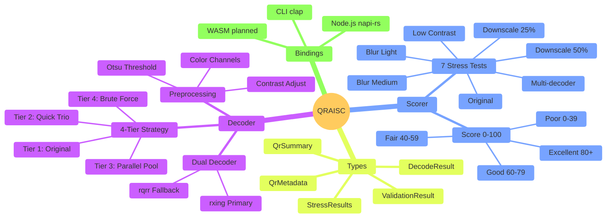
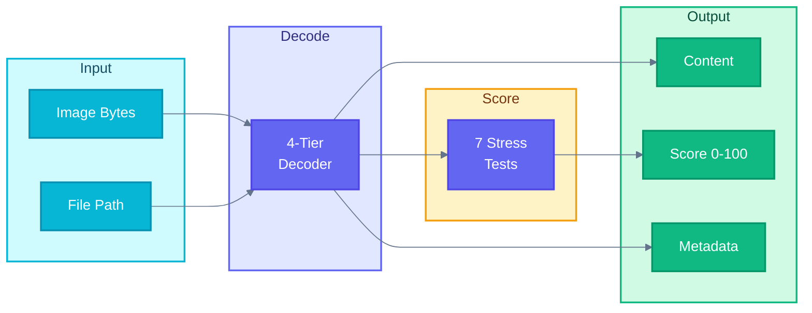
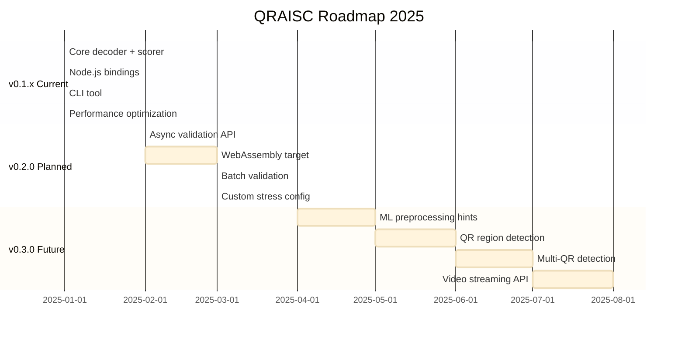

# QRAISC Specification

> **QR AI Scanner** - High-Performance QR Code Validation for Artistic QR Codes

## Overview

QRAISC is a specialized QR code validation library designed to decode AI-generated and artistic QR codes that break standard scanners. It provides scannability scoring to assess production readiness.

## Goals

| Goal | Target | Current |
|------|--------|---------|
| Success rate on artistic QRs | > 85% | 89.2% |
| Average decode time | < 1000ms | 967ms |
| Clean QR decode time | < 200ms | 77ms |
| Score accuracy | Real-world correlation | Stress-test based |

## Non-Goals

- QR code generation (use dedicated generators)
- Barcode formats other than QR (use rxing directly)
- Real-time video scanning (use native camera APIs)

---

## Architecture

### Core Components



### System Flow



### 4-Tier Decoding Strategy

| Tier | Name | Time Budget | Strategy |
|------|------|-------------|----------|
| 1 | Original | ~80ms | Direct decode, no preprocessing |
| 2 | Quick Trio | ~100ms | Otsu threshold + Inverted + High contrast |
| 3 | Parallel Pool | ~500ms | R/G/B channels + HSV + Custom grayscale (parallel) |
| 4 | Brute Force | ~2000ms | 256 random combinations (size, contrast, blur) |

**Early Exit**: Each tier exits immediately on successful decode.

### Dual Decoder System

| Decoder | Library | Origin | Strength |
|---------|---------|--------|----------|
| Primary | rxing | ZXing (Java) | Better on noisy/artistic images |
| Fallback | rqrr | Quirc (C) | Faster on clean images |

Both decoders are tried in parallel during stress tests.

---

## Scannability Score

### Stress Tests

| Test | Weight | Description |
|------|--------|-------------|
| Original | 20 | Decode at original resolution |
| Downscale 50% | 15 | Decode at half size |
| Downscale 25% | 10 | Decode at quarter size |
| Blur (σ=1) | 15 | Light Gaussian blur |
| Blur (σ=2) | 10 | Medium Gaussian blur |
| Low Contrast | 15 | 50% contrast reduction |
| Multi-decoder | 15 | Bonus if both decoders succeed |

### Score Calculation

```
score = (sum of passed test weights) / total_weight × 100
```

### Score Interpretation

| Score | Rating | Recommendation |
|-------|--------|----------------|
| 80-100 | Excellent | Safe for all devices and conditions |
| 70-79 | Good | Production ready, works on most devices |
| 60-69 | Acceptable | May fail on older phones or poor lighting |
| 40-59 | Fair | Consider regenerating with less artistic elements |
| 0-39 | Poor | Regenerate with higher contrast/simpler design |

---

## API Design

### Rust Core

```rust
// Full validation (recommended)
validate(&[u8]) -> Result<ValidationResult>

// Fast validation (reduced stress tests)
validate_fast(&[u8]) -> Result<ValidationResult>

// Decode only (fastest)
decode_only(&[u8]) -> Result<DecodeResult>

// Convenience helpers
is_valid<P: AsRef<Path>>(path) -> Option<String>
score<P: AsRef<Path>>(path) -> u8
passes_threshold<P: AsRef<Path>>(path, min) -> bool
summarize<P: AsRef<Path>>(path) -> QrSummary
```

### Node.js Bindings

```typescript
// Full validation
validate(buffer: Buffer): ValidationResult
validateFast(buffer: Buffer): ValidationResult
decode(buffer: Buffer): DecodeResult

// Convenience helpers
isValid(buffer: Buffer): string | null
score(buffer: Buffer): number
passesThreshold(buffer: Buffer, min: number): boolean
isProductionReady(buffer: Buffer): boolean
summarize(buffer: Buffer): QrSummary
getRating(score: number): string
```

### CLI

```bash
qraisc <image>           # Full validation (JSON)
qraisc -p <image>        # Pretty printed
qraisc -s <image>        # Score only (for scripts)
qraisc -d <image>        # Decode only (fast)
```

---

## Error Handling

### Error Types

| Error | Description | Recovery |
|-------|-------------|----------|
| `ImageLoad` | Failed to parse image bytes | Check image format |
| `DecodeFailed` | No QR code found after all tiers | Image may not contain QR |
| `IoError` | File read/write error | Check file permissions |

### Error Strategy

- Library functions return `Result<T, QraiError>`
- Convenience helpers return `Option<T>` or default values
- Node.js bindings throw JavaScript errors with message

---

## Performance Requirements

### Time Budgets

| Operation | Target | Max |
|-----------|--------|-----|
| Clean QR decode | < 100ms | 200ms |
| Artistic QR decode | < 1000ms | 3000ms |
| Full validation | < 1500ms | 4000ms |
| Fast validation | < 800ms | 2000ms |
| Decode only | < 200ms | 500ms |

### Memory

- No memory leaks (verified with valgrind)
- Image processing done in-place where possible
- Rayon thread pool reused across calls

---

## Testing Strategy

### Unit Tests

- `decoder.rs`: Each preprocessing strategy
- `scorer.rs`: Each stress test, score calculation
- `types.rs`: Serialization roundtrip

### Integration Tests

- Clean generated QRs (qrcode crate)
- Artistic QRs (test-qr-speed/ directory)
- Edge cases (empty, corrupted, non-QR images)

### Benchmarks

- `cargo bench -p qraisc-core`
- Criterion-based microbenchmarks
- Full validation on 74 artistic QRs

---

## Security Considerations

### Input Validation

- All image bytes validated before processing
- No execution of embedded content
- Size limits enforced (max 10MB by default)

### Dependencies

- Regular `cargo audit` checks
- Minimal dependency tree
- No native code except napi-rs

---

## Versioning

Follows [Semantic Versioning](https://semver.org/):

- **MAJOR**: Breaking API changes
- **MINOR**: New features, backward compatible
- **PATCH**: Bug fixes, performance improvements

---

## Roadmap



### v0.2.0 (Planned)

- [ ] Async validation API
- [ ] WebAssembly (WASM) target
- [ ] Batch validation
- [ ] Custom stress test configuration

### v0.3.0 (Future)

- [ ] Machine learning preprocessing hints
- [ ] QR code region detection
- [ ] Multi-QR detection
- [ ] Streaming API for video frames

---

## References

- [QR Code specification (ISO/IEC 18004)](https://www.iso.org/standard/62021.html)
- [rxing - Rust port of ZXing](https://github.com/rxing-core/rxing)
- [rqrr - Rust port of Quirc](https://github.com/nickolay/rqrr)
- [napi-rs - Node.js bindings for Rust](https://napi.rs)
